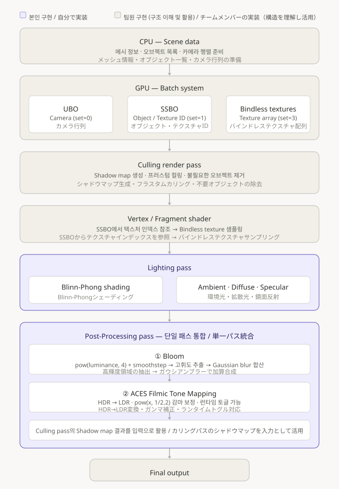

# Vulkan GPU-Driven Rendering

> 졸업 프로젝트 — GPU-Driven Rendering 파이프라인 위에 Lighting 및 Post-Processing 시스템, Imgui를 이용한 디버그UI 구현
> 卒業制作 — GPU駆動レンダリングパイプライン上にLightingおよびPost-Processingシステム、Imguiを使用したデバッグUIの実装

---

## 프로젝트 개요 / プロジェクト概要

본 레포지토리는 팀 졸업과제로 진행된 Vulkan 기반 GPU-Driven Renderer 프로젝트를 **개인 레포지토리로 이전한 것**입니다.  
원본 프레임워크는 팀장의 레포지토리에서 fork하였으며, 이후 독립적인 레포지토리로 옮겼습니다.

このリポジトリは、チーム卒業制作として進めたVulkanベースのGPU駆動レンダラープロジェクトを**個人リポジトリに移行したもの**です。  
元のフレームワークはチームリーダーのリポジトリからforkし、その後独立したリポジトリに移行しました。

### 역할 분담 / 担当範囲

| 담당 / 担当 | 내용 / 内容 |
|------|------|
| **팀장 / チームリーダー** | 전체 프레임워크 설계, Batch System, Culling Render Pass, Shadow Map |
| **본인 / 自分** | Lighting Pass, Post-Processing Pass, Debug UI |

---

## 실행 방법 / セットアップ方法

### 사전 준비 / 事前準備

프로젝트를 빌드하기 전에 **meshoptimizer**를 수동으로 추가해야 합니다.  
ビルド前に **meshoptimizer** を手動で追加する必要があります。

```
프로젝트 루트/
└── ThirdParty/
    └── meshoptimizer.zip   ← 해당 zip파일의 압축을 해제 / このzipファイルを解凍してください
```

1. 압축을 해제합니다. / zipファイルを解凍します。
2. Riche.sln을 실행하고 빌드합니다. / Riche.slnを開いてビルドします。

---

## 파이프라인 구조 / パイプライン構造

아래는 전체 렌더링 파이프라인 구조입니다.

以下は全体のレンダリングパイプライン構造です。  



---

## 구현 내용 / 実装内容

### 1. Lighting Pass — Blinn-Phong Shading

GPU-Driven 파이프라인의 구조를 파악한 뒤, **Lighting 파이프라인을 설계하고 Fragment Shader에서 Blinn-Phong 조명 모델을 구현**했습니다.
GPU駆動パイプラインの構造を把握した上で、**LightingパイプラインをFragment ShaderにてBlinn-Phong照明モデルで実装**しました。

---

### 2. Post-Processing Pass — Bloom + ACES Tone Mapping

Lighting Pass 결과를 입력으로 받아 **Bloom과 ACES Filmic Tone Mapping을 단일 패스에서 순서대로 처리**합니다.
Lightingパスの結果を入力として受け取り、**BloomとACESフィルミックトーンマッピングを単一パスで順次処理**します。

---

### 3. Debug UI — Imgui

Imgui를 이용해서 각종 **파라미터를 조절**하고 특정 **파이프라인을 On/Off**합니다.
Imguiを使用して、各種パラメータを調整し、特定のパイプラインをオン／オフします。

---

## 기술 스택 / 技術スタック

| 항목 / 項目 | 내용 / 内容 |
|------|------|
| Language | C++ |
| Graphics API | Vulkan |
| Shader | GLSL (SPIR-V) |
| Third-Party | meshoptimizer, GLM, GLFW |
| Build | Visual Studio (Riche.sln) |

---
